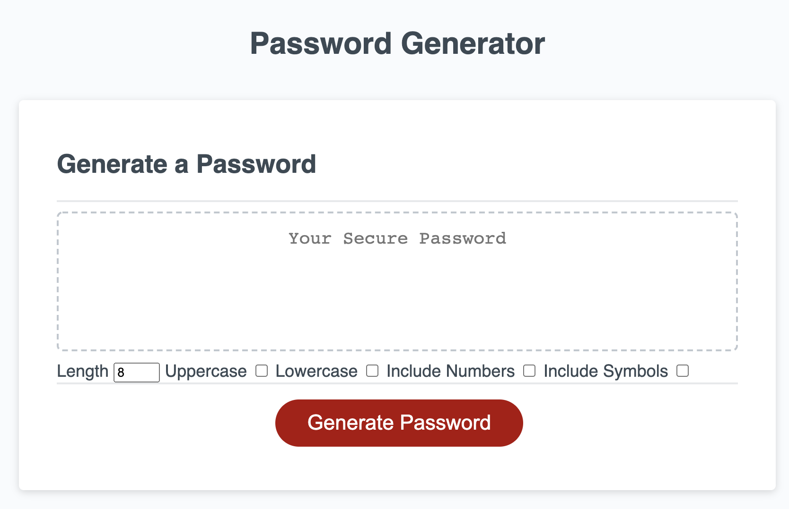

# password-generator

## Purpose
A website to generate a random password between 8-128 characters in length, with different character types included/excluded based on user input. NOTE: this password is not cryptographically secure.

## Built With
* HTML
* CSS
* JavaScript

## Website
https://holmesmainsend.github.io/password-generator/